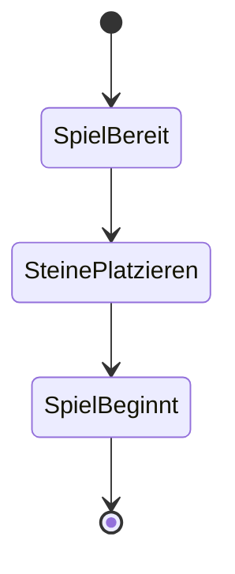
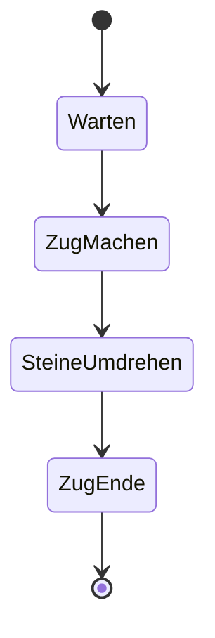
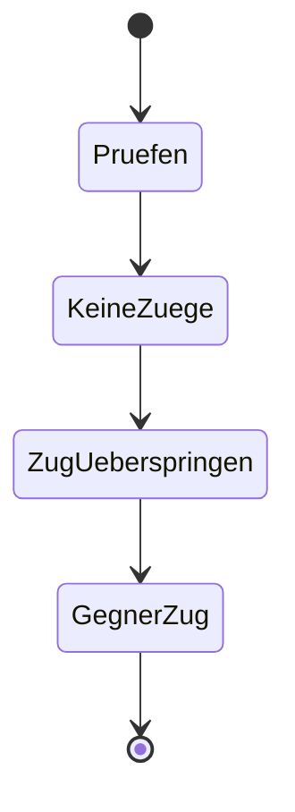
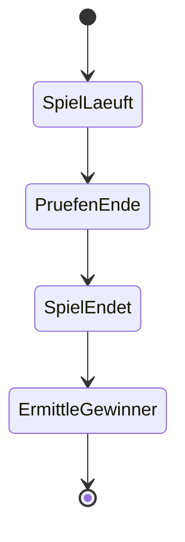

# Reversi Spiel Use Cases

## Use case: UC01 - Spiel starten

| **Actors**                       |        |
| -------------------------------- | ------ |
| Primary actors                   | Spieler   |
| Secondary actors                 | Gegenspieler        |
| **Preconditions**                | Keine |
| **Postconditions**               | Spiel ist initialisiert, Anfangssteine sind positioniert.  |

## Use case: UC02 - Spielzug machen

| **Actors**                       |        |
| -------------------------------- | ------ |
| Primary actors                   | Spieler   |
| Secondary actors                 | Gegenspieler        |
| **Preconditions**                | Spieler ist am Zug, gültige Züge sind möglich. |
| **Postconditions**               | Stein gesetzt, betroffene gegnerische Steine umgedreht.|

## Use case: UC03 - Spielzug überspringen

| **Actors**                       |        |
| -------------------------------- | ------ |
| Primary actors                   | Spieler   |
| Secondary actors                 | Gegenspieler        |
| **Preconditions**                | Keine gültigen Züge möglich für den Spieler. |
| **Postconditions**               | Zug übersprungen, Gegner ist am Zug.|

## Use case: UC04 - Spielende

| **Actors**                       |        |
| -------------------------------- | ------ |
| Primary actors                   | Spieler   |
| Secondary actors                 | Gegenspieler        |
| **Preconditions**                | Alle Felder belegt oder keine gültigen Züge mehr möglich. |
| **Postconditions**               | Spiel beendet, Gewinner ermittelt. |

