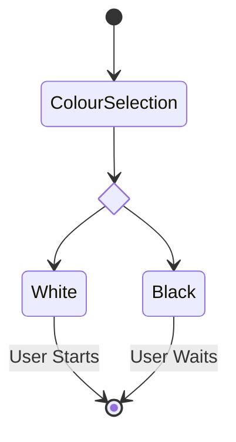
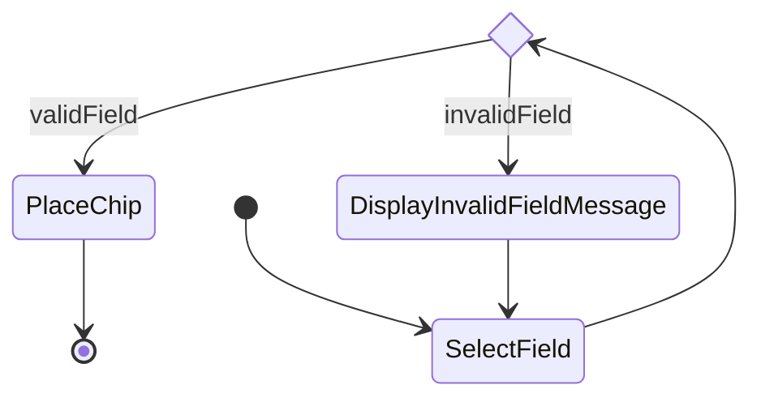
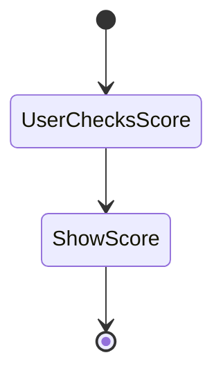

# Use cases

## Use case: Colour selection

| **Actors**                       |        |
| -------------------------------- | ------ |
| Primary actors                   | User   |
| Secondary actors                 | Bot    |
| **Preconditions**                | Game has started |
| **Scenario Sketch**               |        |
| **Standard Flow**               |    User selects a colour (white or black)     |
|                                 |    User gets to start if he selected white    |
| **Postconditions**               |    The sequence of turns has been set    |



## Use case: Users turn

| **Actors**                       |        |
| -------------------------------- | ------ |
| Primary actors                   | User   |
| Secondary actors                 | Bot    |
| **Preconditions**                | Users turn |
| **Scenario Sketch**               |        |
| **Standard Flow**               |    User selects field      |
|                                 |    The selected field is valid    |
|                                 |    Chip gets placed    |
| **Postconditions**               |    End of users turn, Bot is next    |



## Use case: Check score

| **Actors**                       |        |
| -------------------------------- | ------ |
| Primary actors                   | User   |
| Secondary actors                 | Bot    |
| **Preconditions**                | Game has started |
| **Scenario Sketch**               |        |
| **Standard Flow**               |   User checks score      |
|                                 |    Score gets displayed   |
| **Postconditions**               |    Score has been displayed     |


## Use case: Pause Game

| **Actors**                       |        |
| -------------------------------- | ------ |
| Primary actors                   | User   |
| Secondary actors                 | Bot    |
| **Preconditions**                | Game is running |
| **Scenario Sketch**               |        |
| **Standard Flow**               |    User pauses the game      |
|                                 |    The user decides whether the game should continue, end, or be saved before ending|                             
| **Postconditions**               |    Game ends or continues    |

```mermaid
stateDiagram-v2
state if_state <<choice>>
[*] --> UserPausesGame
UserPausesGame --> if_state
if_state --> SaveScore:Save & Exit
if_state --> EndGame:Exit
if_state --> ContinueGame:Continue
SaveScore --> EndGame
EndGame --> [*]
ContinueGame --> [*]
