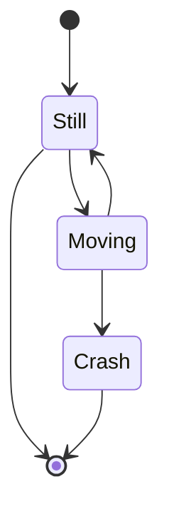
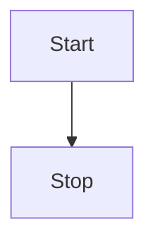

# Use cases

## Use case: XYZ

| **Actors**                       |        |
| -------------------------------- | ------ |
| Primary actors                   | User   |
| Secondary actors                 |        |
| **Preconditions**                | System is activated |
| **Postconditions**               |        |

